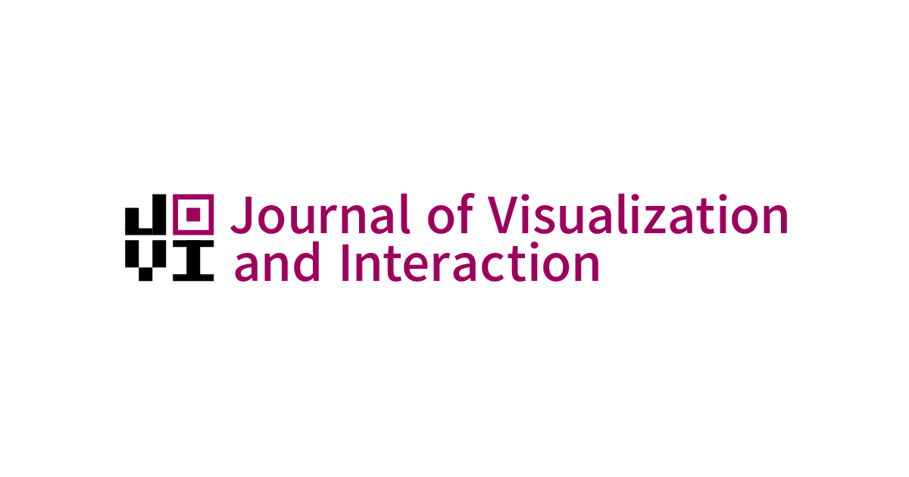

<a href="https://www.journalovi.org/">
  

    <picture>
      
    </picture>
  

</a>

  
  

[JoVI](https://www.journalovi.org/) is a venue for publishing scholarly work related to the fields of visualization and human-computer interaction. JoVI is a diamond open-access venue, i.e. a purely volunteer-driven effort that charges neither author nor subscription fees.
